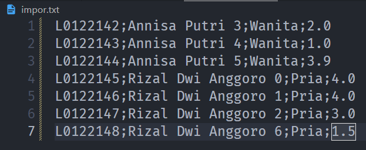
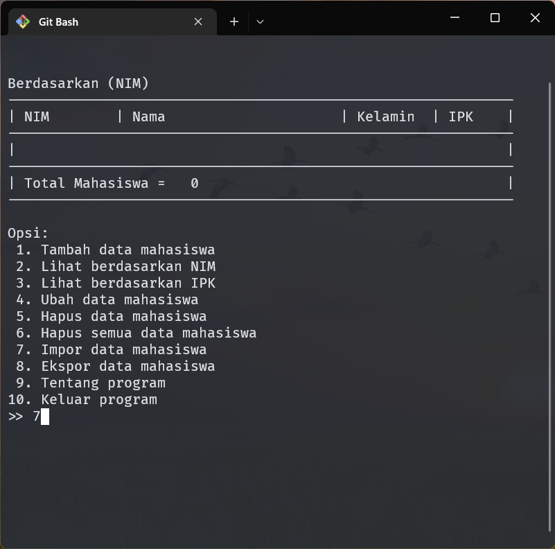
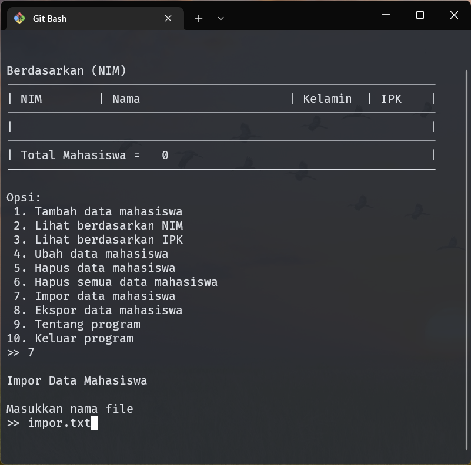
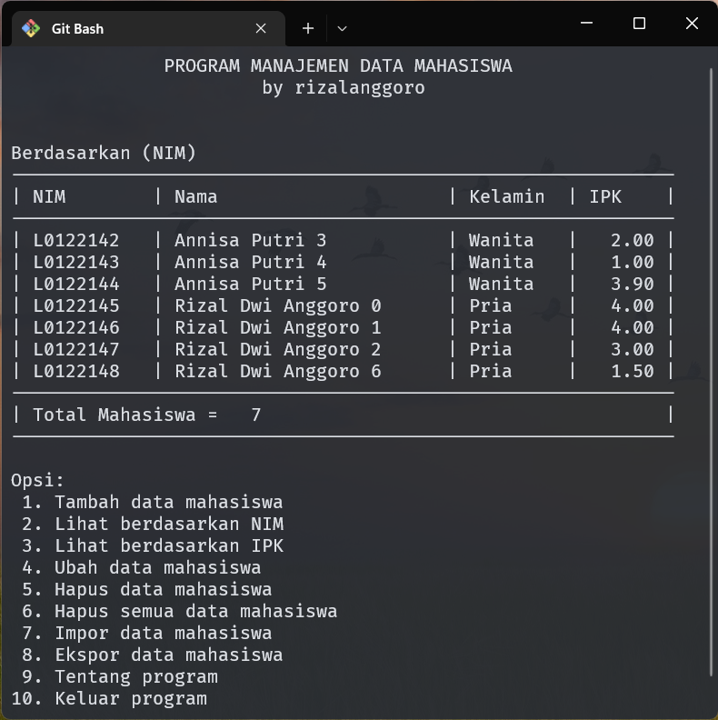

# [Program Manajemen Data Mahasiswa](https://github.com/rizalanggoro/PKP-Responsi-2)

## [Responsi Praktikum Konsep Pemrograman]

### Data Diri

- Nama : Rizal Dwi Anggoro
- NIM : L0122142
- Kelas : D Informatika

### Tugas: 

Buatlah program manajemen data mahasiswa, yang berupa struct dan berisi:

1. NIM
2. Nama
3. Jenis kelamin
4. IPK

Pastikan program dapat menambah, mengubah, menghapus, mencetak data mahasiswa,
serta mengimpor dan mengekspor data mahasiswa dari file .txt menggunakan File
Handling yang sudah kalian pelajari. Kalian bisa membuat antarmuka untuk user
agar dapat memilih keenam pilihan tersebut. Pastikan kalian memberikan
penjelasan program kalian dengan memberi komentar di samping atau di atas kode
yang dibuat. Selain ketentuan di atas, kalian bebas untuk mengkreasikan
program kalian.

### Fitur Program

- Tabel data mahasiswa
- Menambahkan data mahasiswa
- Mengurutkan data mahasiswa berdasarkan NIM dan IPK
- Mengubah data mahasiswa berdasarkan NIM
- Menghapus data mahasiswa berdasarkan NIM
- Menghapus seluruh data mahasiswa
- Mengimpor data mahasiswa dari file.txt
- Mengekspor data mahasiswa ke file.txt (dalam bentuk tabel)

### Cara Mengimpor Data Mahasiswa

1. Buat file txt baru, contoh `impor.txt`
2. Masukkan data yang akan diimpor ke dalam "impor.txt" dengan format `nim;nama;jenis_kelamin;ipk` seperti berikut.   
    
   Pastikan setiap `field` dipisahkan dengan `;` karena akan dilakukan split string menggunakan delimiter `;`.
3. Masuk pada program, lalu masukkan angka `7` kemudian tekan `enter`.   
   
4. Masukkan nama file, contoh `impor.txt`, kemudian tekan enter.  
   
5. Maka data akan otomatis terimpor dan disimpan ke database binary.  
   
